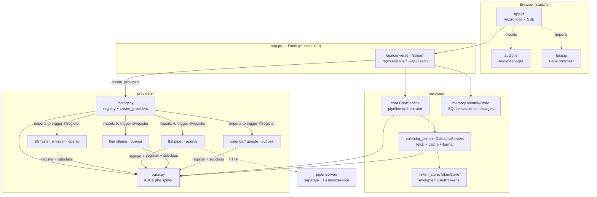
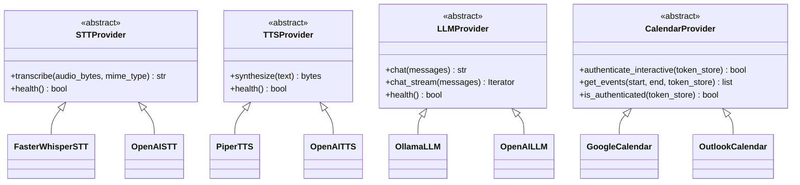
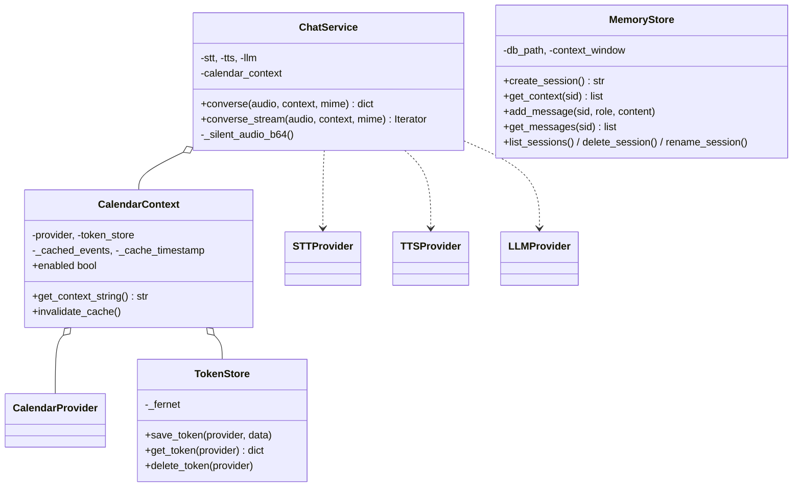
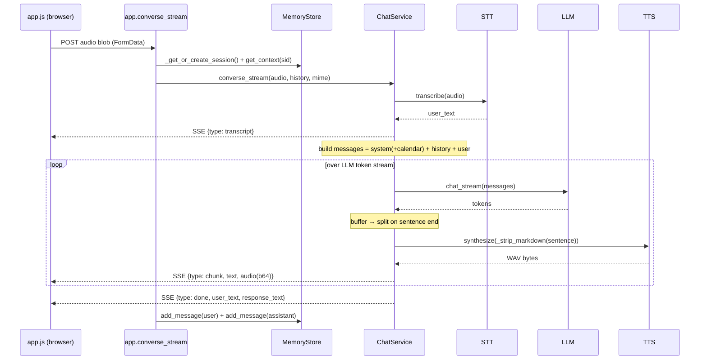
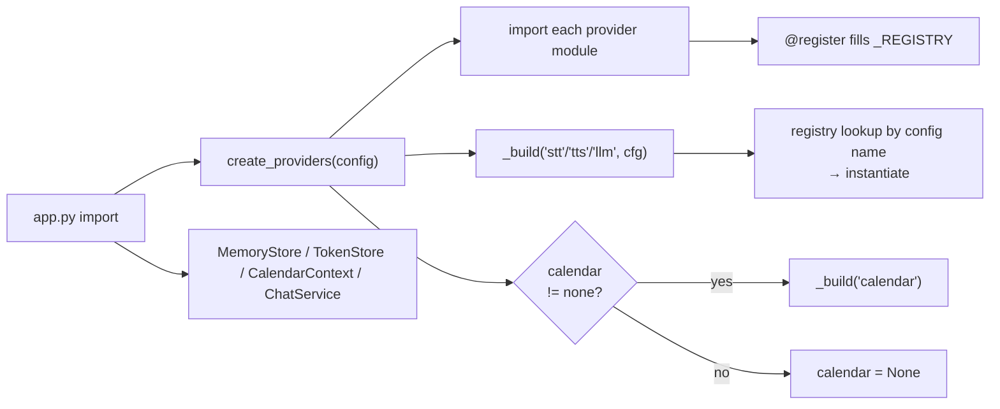

# Architecture Map — mirabot
_Generated 2026-07-01 · 22 Python modules, 16 classes, ~90 functions (+ JS frontend) · Flask + pluggable providers_

## What this is

Mirabot is a voice-driven "smart mirror" assistant. You hold a mic button (or press Space), speak, and it transcribes → sends to an LLM → speaks the reply back, with an animated face whose mouth moves in sync with the audio. Conversations are persisted per-session in SQLite, and it can optionally inject your calendar into the LLM's context.

Architecturally it's a **layered pipeline behind a plugin registry**: a thin Flask HTTP/CLI layer (`app.py`) → a service layer that orchestrates the STT→LLM→TTS pipeline and owns persistence (`services/`) → a swappable provider layer where every external capability (speech-to-text, text-to-speech, LLM, calendar) is an ABC with concrete implementations registered by name (`providers/`). Config in `config.yaml` picks which concrete provider fills each slot, so switching from local (Ollama + faster-whisper + Piper) to cloud (OpenAI) is a config change, not a code change.

## System map



**Layers & spine.** Three layers — HTTP/CLI (`app.py`), services (`services/`), providers (`providers/`) — plus a decoupled browser frontend and an out-of-process Piper TTS microservice. The **spine is `providers/base.py`** (imported by 11 modules): the four ABCs every provider implements. `providers/factory.py` (import fan-in 9) is the second load-bearing module — it holds the name→class registry and the `create_providers()` assembly function. Notice the dependency direction: services and concrete providers both depend *inward* on `base`; nothing in `base` depends outward. Concrete providers are wired in only by `factory` importing them so their `@register` decorators fire.

## Key components

### Provider contracts (the plugin seam)



Each ABC is a one-method-that-matters contract (`transcribe`, `synthesize`, `chat`, `get_events`) plus a default `health()`. `LLMProvider.chat_stream()` has a default that wraps `chat()` in a single yield, so a non-streaming provider still works with the streaming route. Adding a provider is: subclass the ABC, decorate with `@register("<type>", "<name>")`, add one import line in `factory.create_providers()`.

### Service layer



- **`ChatService`** is the orchestrator: it owns the three pipeline providers plus an optional `CalendarContext`, and exposes both a blocking `converse()` and a generator `converse_stream()`. It's also where `_strip_markdown()` and the sentence-splitting regex live — the streaming path chops the LLM token stream into sentences so each can be synthesized and shipped as soon as it's complete.
- **`MemoryStore`** is the only writer of the `sessions`/`messages` SQLite tables. `get_context()` returns the last `context_window` messages (default 20) for the LLM; `get_messages()` returns the full history for display. Every method opens its own short-lived WAL connection via `_connect()` (fan-in 11 — the single most-called internal function).
- **`CalendarContext`** fetches events through a `CalendarProvider`, caches them in memory with a TTL, and renders them as a natural-language block that gets appended to the system prompt.
- **`TokenStore`** persists OAuth tokens encrypted with Fernet, keyed off a SHA-256 of the Flask secret — no plaintext tokens on disk. Shares the same SQLite DB file as `MemoryStore`.

## How it flows

### Flow 1 — The streaming voice loop (`POST /api/converse/stream`) — the main path



1. The browser records a WebM blob (`AudioManager.stop()`) and POSTs it to `/api/converse/stream`.
2. The route reads the bytes, resolves the session (`_get_or_create_session` → cookie `sid`, create if missing), and pulls the recent context window from `MemoryStore`.
3. It hands off to `ChatService.converse_stream()`, a generator. First it transcribes the whole clip (STT is **not** streamed) and immediately yields a `transcript` event.
4. It builds the message list: system prompt, optionally with the calendar block appended, then the history, then the user turn.
5. It streams LLM tokens, accumulating into a buffer. Whenever the sentence-split regex finds a complete sentence, that sentence is markdown-stripped, synthesized to WAV by the TTS provider, base64-encoded, and yielded as a `chunk` event. This is the key latency trick — audio starts playing after the first sentence, not after the whole reply.
6. On `done`, the route (in the `generate()` closure) writes the user and assistant messages back to `MemoryStore`. **Persistence happens in the route, not the service** — the service is stateless.
7. Client side: `processAudio()` reads the SSE stream, pushes each `chunk`'s audio into `audioQueue`, and `drainQueue()` plays them in order while a `requestAnimationFrame` loop reads amplitude and drives the mouth. The mic isn't released until the stream is done *and* the queue is fully drained (`checkComplete`).

### Flow 2 — Non-streaming `POST /api/converse` (fallback)

Same shape, collapsed: `converse()` transcribes, calls `llm.chat()` once for the full reply, synthesizes the entire text to one WAV, and returns a single JSON `{user_text, response_text, audio_b64}`. The route persists both messages after. Simpler, higher latency; the frontend uses the streaming route.

### Flow 3 — Startup & provider wiring (module import time)



At import, `app.py` calls `create_providers(config)`. That function force-imports all eight concrete provider modules (triggering their `@register` decorators to populate `_REGISTRY`), then `_build()` looks up the class named in each config slot and instantiates it. Calendar is optional — `none`/missing yields `None`, and everything downstream (`CalendarContext`, the `/health` check, the CLI) guards on that. The singletons (`memory`, `token_store`, `calendar_context`, `chat_service`) are then constructed at module scope and shared across requests.

### Flow 4 — Calendar CLI (`flask calendar-setup`)

Three Click CLI commands live in `app.py`. `calendar-setup` runs the provider's interactive OAuth flow, saves the encrypted token via `TokenStore`, then fetches the next day's events as a smoke test. `calendar-status` reports config + auth state and prints a context preview; `calendar-logout` deletes the token and invalidates the cache. These are the only writers into `TokenStore`.

## Where to start

Read in this order:

1. **[app.py](app.py)** — the whole HTTP/CLI surface and how the singletons are wired. Start at `converse_stream` (line 133) and `_get_or_create_session` (line 83).
2. **[services/chat.py](services/chat.py)** — the actual pipeline logic and the streaming sentence-chunking trick (`converse_stream`, line 109).
3. **[providers/base.py](providers/base.py)** + **[providers/factory.py](providers/factory.py)** — the plugin seam. Once you see the four ABCs and the registry, every concrete provider is obvious.
4. **[services/memory.py](services/memory.py)** — the persistence model (sessions/messages, context window).
5. **[static/js/app.js](static/js/app.js)** — the client record→SSE→playback loop, if you care about the UX side.

## Notes & gaps

- **JS/TS not statically analyzed.** tree-sitter isn't installed, so the analyzer mapped only the 22 Python modules; `app.js`, `audio.js`, `face.js` were read by hand for this doc. The frontend classes (`AudioManager`, `FaceController`) and the `processAudio` loop aren't in `repo-map.json`. Install `tree-sitter tree-sitter-javascript` to fold them in.
- **Dynamic dispatch the static graph misses.** The whole point of the provider layer is that `ChatService` calls `self.stt.transcribe()`, `self.llm.chat_stream()`, etc. through ABC references — the resolver can't tie those to the concrete `OllamaLLM`/`PiperTTS` classes, so the call graph under-reports the hottest real edges (they're verified by hand above). Same for `_build()`'s `cls(config)` and the `@register` registry — pure runtime wiring.
- **Piper is a separate service.** `PiperTTS.synthesize()` makes an HTTP call to the `piper-server/` Flask app (its own container), not an in-process call — it won't appear as an internal edge.
- **Two `__main__` entry points reported;** the real dev server is `app.py`'s `app.run(...)` (line 395). The Flask CLI (`flask run` / `flask calendar-*`) is the production entry.
- **`.orig`/`.bak` files** (`providers/base.py.orig`, `Dockerfile.bak`, `docker-compose.yml.orig`) are stale merge/backup artifacts, not live code — ignore them when reading.
```
